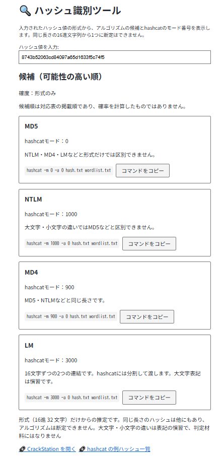
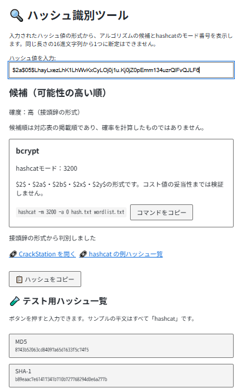

# Hash Identifier

English · [日本語](README.md)


[](https://ipusiron.github.io/hash-detector/)

**Day002 - 100 Security Tools with Generative AI**

Paste a hash value and this tool lists the algorithms whose format matches it, together with the hashcat mode number and a ready-made command for each one. Everything runs in the browser; nothing is uploaded.

---

## 🌐 Demo

👉 [https://ipusiron.github.io/hash-detector/](https://ipusiron.github.io/hash-detector/)

---

## 📸 Screenshots

> 
>
> *A 32-character hex hash. MD5, NTLM, MD4 and LM all fit, which is exactly why the format alone cannot settle the question*

> 
>
> *A bcrypt hash, recognised from its prefix, with hashcat mode 3200*

---

## ✨ Supported formats

A string made only of hex digits is matched by length, so several algorithms are listed and none of them is claimed to be the answer.
Mode numbers come from the [official hashcat example-hash list](https://hashcat.net/wiki/doku.php?id=example_hashes) (checked 18 September 2026).

| Algorithm | How it is recognised (length or prefix) | hashcat mode | Notes |
|--------------|------------------------|----------------|------|
| CRC32 | 8 hex characters | 11500 | hashcat expects a salt field, as in `<crc32>:00000000` |
| Adler-32 | 8 hex characters | — | No dedicated mode found in the official list |
| MySQL 3.x | 16 hex characters | 200 | MySQL323 |
| Half of an LM hash | 16 hex characters | 3000 | 8 bytes of an LM hash; hashcat works on 16-character halves |
| MD5 | 32 hex characters | 0 | Same length as NTLM, MD4 and LM |
| NTLM | 32 hex characters | 1000 | Letter case does not separate it from MD5 |
| MD4 | 32 hex characters | 900 | Same length as MD5 and NTLM |
| LM | 32 hex characters | 3000 | Split into two halves before passing to hashcat; upper case is a convention |
| SHA-1 | 40 hex characters | 100 | 160-bit output |
| RIPEMD-160 | 40 hex characters | 6000 | Same length as SHA-1 |
| SHA-224 | 56 hex characters | 1300 | SHA-2 family |
| SHA3-224 | 56 hex characters | 17300 | Same length as SHA-224 |
| SHA-256 | 64 hex characters | 1400 | SHA-2 family |
| SHA3-256 | 64 hex characters | 17400 | Same length as SHA-256 |
| Keccak-256 | 64 hex characters | 17800 | A different algorithm from SHA3-256 |
| BLAKE2s-256 | 64 hex characters | 31000 | hashcat expects a `$BLAKE2$` prefix; marked beta or unreleased in the official list |
| SHA-384 | 96 hex characters | 10800 | SHA-2 family |
| SHA3-384 | 96 hex characters | 17500 | Same length as SHA-384 |
| SHA-512 | 128 hex characters | 1700 | SHA-2 family |
| SHA3-512 | 128 hex characters | 17600 | Same length as SHA-512 |
| Keccak-512 | 128 hex characters | 18000 | 17900 is Keccak-384, a different thing |
| Whirlpool | 128 hex characters | 6100 | 512-bit output |
| BLAKE2b-512 | 128 hex characters, or `$BLAKE2$` + 128 hex characters | 600 | Without the prefix, add `$BLAKE2$` before passing it to hashcat |
| MySQL 4.1+ | `*` + 40 hex characters | 300 | Strip the leading `*` for hashcat |
| md5crypt | `$1$` + salt + 22-character digest | 500 | Salt is 1-8 characters |
| Apache apr1 | `$apr1$` + salt + 22-character digest | 1600 | Salt is 1-8 characters |
| sha256crypt | `$5$` + salt + 43-character digest | 7400 | Salt is 1-16 characters; `rounds=N$` is optional |
| sha512crypt | `$6$` + salt + 86-character digest | 1800 | Salt is 1-16 characters; `rounds=N$` is optional |
| bcrypt | `$2$`, `$2a$`, `$2b$`, `$2x$` or `$2y$` | 3200 | Two cost digits + `$` + 53 characters |
| phpass | `$P$` or `$H$` + 31 characters | 400 | WordPress, phpBB and others |
| Django PBKDF2-SHA256 | `pbkdf2_sha256$` | 10000 | Iteration count, salt and Base64 digest |
| scrypt | `SCRYPT:` | 8900 | Three numeric parameters, a salt and a digest |
| LDAP {SHA} | `{SHA}` + 27 Base64 characters + `=` | 101 | SHA-1 as used by LDAP |
| LDAP {SSHA} | `{SSHA}` + Base64 | 111 | Salted SHA-1 |
| Argon2 | `$argon2id$`, `$argon2i$`, `$argon2d$` | 34000 | Prefix only; check what your hashcat version supports |
| yescrypt | `$y$` | — | Prefix only; no dedicated mode found in the official list |

A dash appears on screen as "— (unconfirmed)". It means the dedicated mode for Adler-32 and yescrypt could not be confirmed, not that hashcat has no support at all.
The official list's "scrypt [Bridged: Scrypt-Yescrypt]" entry covers the `SCRYPT:` format, so it is not assigned to the `$y$` form of yescrypt.

---

## 📖 How to use it

1. Open the demo page above
2. Type or paste a hash; candidates, hashcat modes and caveats appear as you type
3. Press one of the sample buttons to see how a known value is classified
4. Use "Copy command" or "Copy hash" to take the string you need
5. Switch between Japanese and English with the button in the top right

Surrounding whitespace is trimmed, but letter case is left alone.
Candidates whose mode is unconfirmed get no command.
The `hash.txt` and `wordlist.txt` in the example command are files you supply yourself. "Copy hash" copies the input verbatim, so for MySQL, LM, CRC32 and BLAKE2 you still need to adjust the value as the candidate's note describes.
A toast confirms the copy for a few seconds. Where the Clipboard API is unavailable it says "Copy failed" and the identification keeps working.

The interface language follows, in order, the `?lang=ja` / `?lang=en` query parameter, the previously chosen language, and the browser's own language setting. The choice is kept in localStorage. Switching languages while a hash is being examined keeps both the input and the candidate list in place.

## 🔬 How the guess is made, and where it stops

Prefixed patterns are tried first. If one matches, only that format is returned.
Otherwise the value is checked for being hex only, and the candidates for that length are listed. For a length that is not in the table, the character count is shown instead.
An empty input field shows nothing at all. The result area is a live region, so it must not announce "no supported format matched" before anything has been typed.
Confidence reads "high" for a prefix match and "format only" for a hex string. Neither says anything about where the hash came from or whether it is valid.
"Candidates (most likely first)" follows the order of the reference table. It is not a ranking computed from probabilities.

Letter case carries no information about the algorithm. LM hashes are conventionally written in upper case, but a 32-character hex input still cannot be separated into MD5, NTLM, MD4 or LM.
MySQL 4.1+ values are displayed with the leading `*`, which must be removed for hashcat.
A 32-character LM hash is really two 16-character halves of 8 bytes each. hashcat mode 3000 works on one half at a time.

Argon2 and yescrypt are detected from the prefix alone; the rest of the syntax and the parameters are not validated.
The other prefixed formats are matched by a regular expression, which does not check iteration ranges or decode the Base64 payload.
The `$BLAKE2$` + 64-character form is not part of the prefix table. BLAKE2s-256 appears as a candidate for 64 hex characters.
Other algorithms share these formats, and formats outside the table exist. To be certain, consult the specification of whatever produced the hash.

## 🧪 About the sample hashes

The ten samples on screen and the known vectors in the tests come from the [official hashcat example-hash list](https://hashcat.net/wiki/doku.php?id=example_hashes). The plaintext is always `hashcat`.
The MySQL 4.1+ sample is the official example with a `*` prepended and written in upper case; the CRC32 vector is the first 8 characters of the official example, with the salt field removed.
Eleven of them - MD5, SHA-1, the SHA-2 family, the SHA-3 family and RIPEMD-160 - are recomputed in the tests with Node.js's built-in `node:crypto` and compared. The browser side has no hashing function of its own.

## 🧪 Tests

With Node.js 22 or later:

```bash
npm test
```

There are no dependencies, so `npm install` is not needed.

The built-in `node --test` runner checks the known vectors, candidate order, prefixes, empty input and unsupported formats. It also compares the table in this README against the names and mode numbers in the code, and the ten on-screen samples against the candidates they should produce.
The Japanese and English dictionaries are checked too: both must hold the same keys and the same placeholders, every key used by the HTML and the scripts must exist, no Japanese may be left in the English dictionary, and no state may be decided by comparing displayed text.
GitHub Actions runs the same suite on Node.js 22 for every push and pull request.

---

## 🔒 Security and privacy

The tool is entirely client-side. Nothing you type is sent anywhere or stored. There is no lookup against an external API.
Loading the HTML, JavaScript and CSS over HTTP, and following a link you chose to click, are of course separate matters.
The input value lives in the input field and the matching code. It is never written to a cookie or to web storage. The only thing kept in localStorage is your chosen display language (`hash-detector-language`).

A CSP restricts where resources may come from, and no inline event handlers or styles are used. The referrer policy is `no-referrer`.
Results are built with `createElement` and `textContent`.
The only outbound links are CrackStation and the hashcat example-hash list, and no hash is ever appended to a URL. Links that open a new tab carry `noopener noreferrer`.
Copying uses the Clipboard API, which needs a secure context and the browser's permission. It can still fail on HTTPS, localhost or `file://` depending on the browser.
Browser extensions, and whatever happens after you follow a link elsewhere, are beyond what this tool can protect.

---

## 📁 Directory layout

```text
hash-detector/
├── .github/
│   └── workflows/
│       └── test.yml    # tests on push and pull request
├── test/
│   ├── identify.test.js # known vectors, candidates and mode numbers
│   ├── i18n.test.js     # dictionaries, key existence and language wiring
│   ├── readme.test.js   # README table against the code
│   └── html.test.js     # samples, CSP and accessibility
├── .gitignore
├── index.html          # input field, results and sample buttons
├── i18n.js             # Japanese and English dictionaries, language switching
├── identify.js         # DOM-free matching module
├── script.js           # DOM handling, copying and the toast
├── style.css           # mobile layout, wrapping and focus styles
├── package.json        # dependency-free test command
├── screen_sample.png   # four candidates for a 32-character hex hash
├── screen_bcrypt.png   # bcrypt recognised from its prefix
├── CLAUDE.md           # structure, matching rules, development notes
├── README.md           # Japanese documentation
├── README.en.md        # this document
└── LICENSE             # MIT
```

## 💻 Requirements

- A modern browser (no external libraries, no build step)
- Offline: open `index.html` directly over `file://`
- Over HTTP: run `python -m http.server 8000` in the repository folder and visit `http://localhost:8000/`
- Tests: Node.js 22 or later

---

## 📄 License

[MIT License](LICENSE)

---

## 👤 Author

- [@ipusiron](https://github.com/ipusiron)

---

## 🛠️ About this tool

This tool is part of the "100 Security Tools with Generative AI" project, in which a security-related tool is built and published every day for 100 days with the help of generative AI.

For the project and the other tools:

🔗 [https://akademeia.info/?page_id=42163](https://akademeia.info/?page_id=42163)
