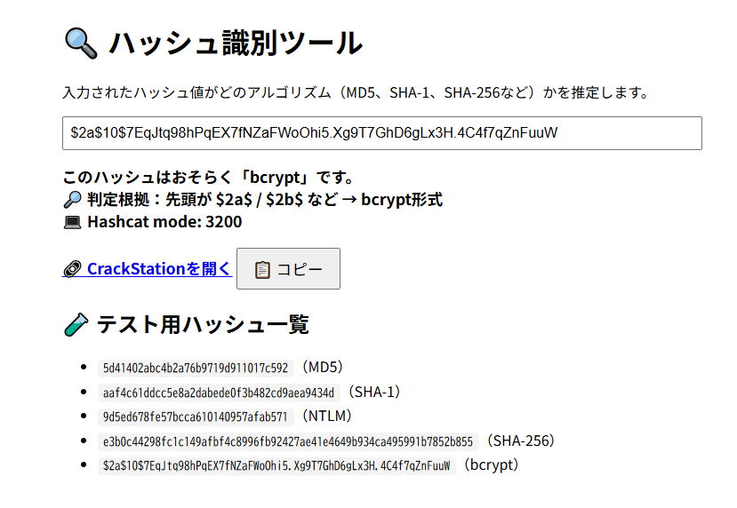

<!--
---
id: day002
slug: hash-detector

title: "Hash Identifier"

subtitle_ja: "ハッシュ種別判定ツール"
subtitle_en: "Hash Algorithm Identification Tool"

description_ja: "入力されたハッシュ値がどのアルゴリズム（MD5, SHA-1, SHA-256など）で生成されたものかを推測するクライアントサイドツール"
description_en: "A client-side tool that identifies which hash algorithm (MD5, SHA-1, SHA-256, etc.) was likely used to generate an input string"

category_ja:
  - 現代暗号
category_en:
  - Mordern cryptography

difficulty: 1

tags:
  - hash
  - md5
  - sha1
  - sha256
  - bcrypt
  - ntlm
  - hashcat

repo_url: "https://github.com/ipusiron/hash-detector"
demo_url: "https://ipusiron.github.io/hash-detector/"

hub: true
---
-->

# 🔍 ハッシュ識別ツール（Hash Identifier）

**Day 2 - セキュリティツールをAIで作ってみよう 100日チャレンジ**

このツールは、入力された文字列がどのハッシュアルゴリズム（MD5, SHA-1, SHA-256 など）で生成されたものかを推測します。  
形式と文字長に基づいてシンプルに判定する軽量なWebアプリです。

---

## 🌐 デモページ

👉 [https://ipusiron.github.io/hash-detector/](https://ipusiron.github.io/hash-detector/)

---

## 📸 サンプル画面

> 以下は実際の画面例です（GitHub Pages上の表示例）  
>
> 

---

## ✨ 対応ハッシュ形式

| アルゴリズム | 特徴                         |
|--------------|------------------------------|
| MD5          | 32文字の16進数               |
| SHA-1        | 40文字の16進数               |
| SHA-256      | 64文字の16進数               |
| SHA-512      | 128文字の16進数              |
| bcrypt       | `$2a$` や `$2b$` などで始まる |
| NTLM         | MD5と同じ32文字、全大文字     |

---

## 🚀 使い方

1. 上記のデモページにアクセス
2. ハッシュ値（例：`5d41402abc4b2a76b9719d911017c592`）を入力
3. 「判定する」ボタンをクリック
4. 推定されたハッシュ種別が表示されます

---

## 📁 ファイル構成

- `index.html` – ユーザーインターフェース
- `script.js` – ハッシュ種別の判定ロジック

---

## 🔒 補足

このツールは完全にクライアントサイドで動作し、入力データは送信・保存されません。

---

## 📜 ライセンス

[MIT License](LICENSE)

---

## 👤 作者

- [@ipusiron](https://github.com/ipusiron)

